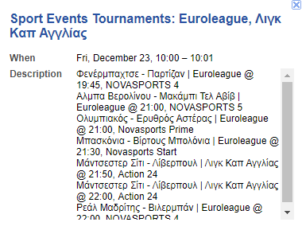

# Parse Sports TV events from https://www.sport-fm.gr/tv on a daily basis.

This project scrapes https://www.sport-fm.gr/tv to get each day's sports events that are of interest and then creates a single Google Calendar event on a selected calendar.

Example event:

    Title: Sport Events Tournaments: Euroleague, Λιγκ Καπ Αγγλίας
    Date: Friday, December 23, 10:00 – 10:01
    Description: 
    Φενέρμπαχτσε - Παρτίζαν | Euroleague @ 19:45, NOVASPORTS 4
    Αλμπα Βερολίνου - Μακάμπι Τελ Αβίβ | Euroleague @ 21:00, NOVASPORTS 5
    Ολυμπιακός - Ερυθρός Αστέρας | Euroleague @ 21:00, Novasports Prime
    Μπασκόνια - Βίρτους Μπολόνια | Euroleague @ 21:30, Novasports Start
    Μάντσεστερ Σίτι - Λίβερπουλ | Λιγκ Καπ Αγγλίας @ 21:50, Action 24
    Μάντσεστερ Σίτι - Λίβερπουλ | Λιγκ Καπ Αγγλίας @ 22:00, Action 24
    Ρεάλ Μαδρίτης - Βιλερμπάν | Euroleague @ 22:00, NOVASPORTS 4

# How to run

First, create your virtual environment using:
> python -m venv venv

Then activate your virtual environment, eg. for Linux run:
> source venv/bin/activate

And once your virtual environment has been activated, install all dependencies using:
> pip install -r requirements.txt

Then make sure you create a `.env` file based on the structure of the `.env.example` file. This file will contain all environment variables. You need to provide the `CALENDAR_ID` and `CALENDAR_NAME` that you can get from the calendar you have created at your Google account.

Then, from the Google Cloud project you need to create, you will need to have a `.credentials/` directory, within which the `credentials.json` file will be. This file is downloaded from within the Google Cloud `OAuth 2.0 Client IDs` section and the key you create there in order to get access to the Google Calendar API service.

Once all the above steps are completed, you can then run the application with:
> python scrape.py